# DEvops2

> since It is always good to make a seperate directory for this type of work so i made a seperate directory using 
the task allocated was as follows:
mkdir /dir_name

>the first step was to create a container image that had Jenkins installed which was done using docker file 

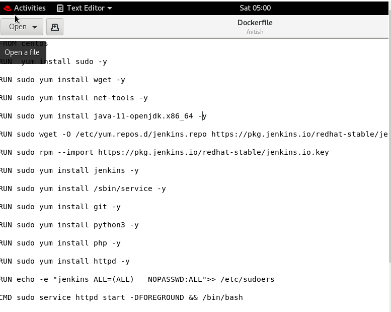

>after the creation of docker, file build took place

>command is as docker build -t jenkos .

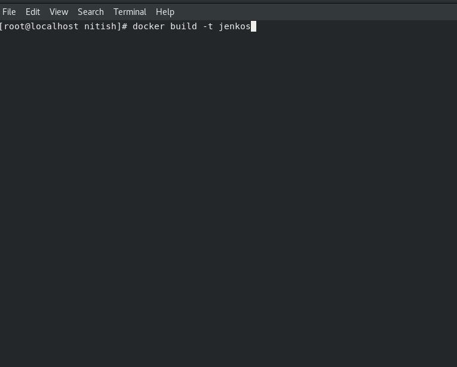

>for running the container docker run -dit -p __:8080 --name___ image command is used since I have exposed the 8080 port.

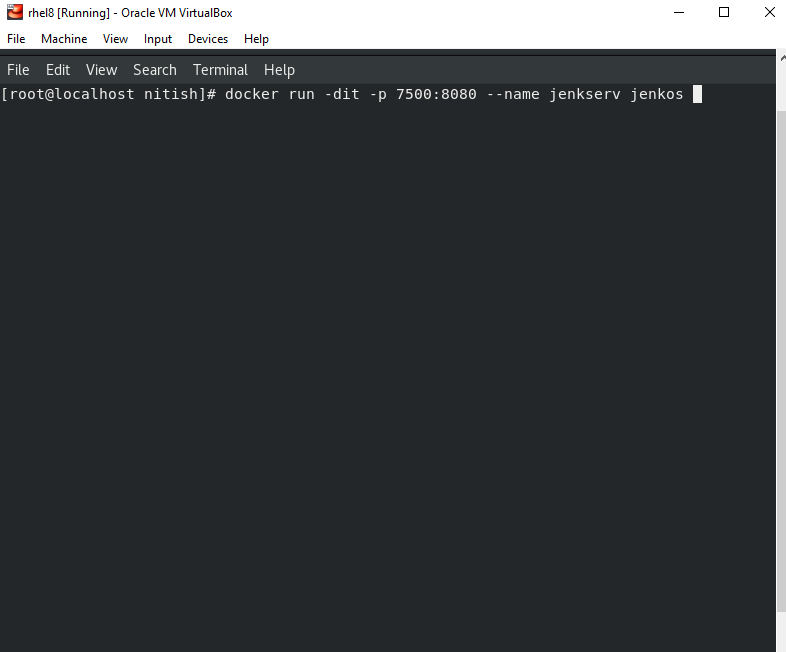

>To boot the container with systemctl --privileged can also be used or for starting , stopping knowing the status of Jenkins /etc/init.d/Jenkins start/stop/status can be used

To do ssh with the host system key needed to be generated using ssh-keygen

> Creation a job chain of job1, job2, job3 and job4 using build pipeline plugin in Jenkins 

>the functions of different jobs are as follows

>Job1: Pull the Github repo automatically when some developers push the repo to Github.
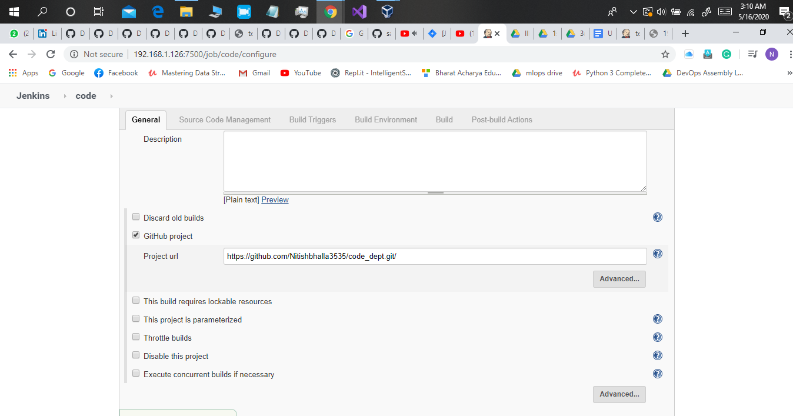

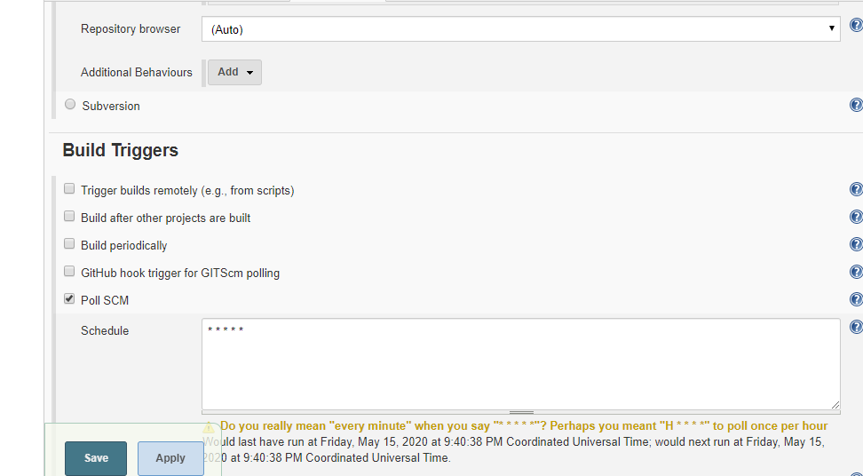

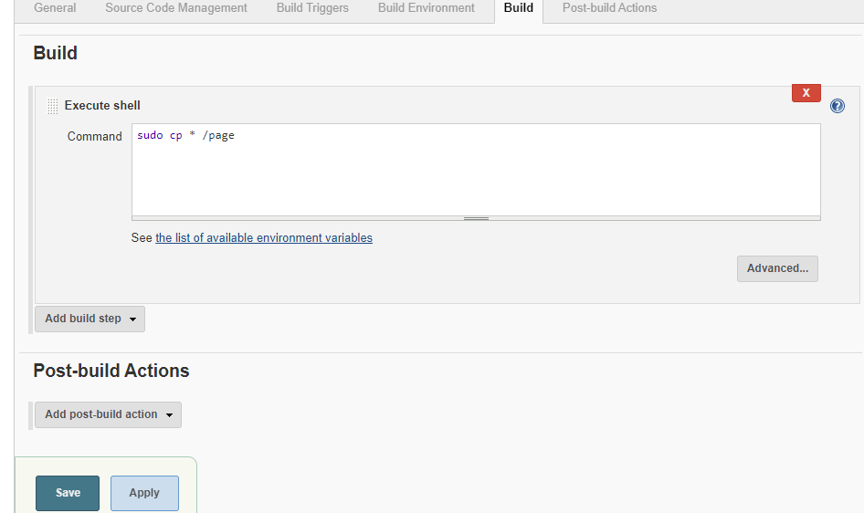

>it is used to copy the data from the page directory

> Job2: By looking at the program file, Jenkins automatically start the respective language interpreter and installation of respective image container takes place to deploy code.

This job's build will depend on build of job1 or code

SCP is used to copy the data of the directory of container to the directory of localhost system

>  Job3: Test of the program if it is working or not.

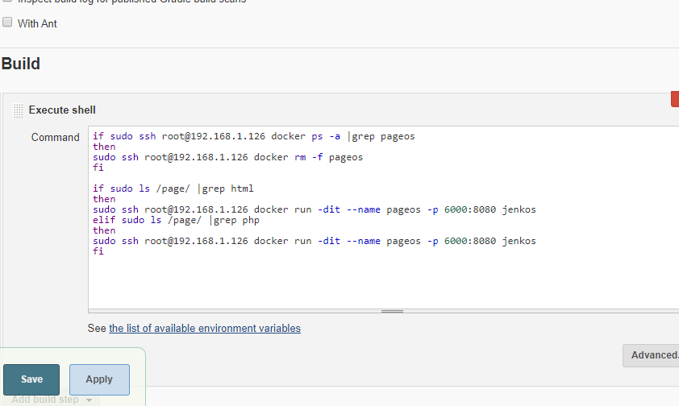

> Job4: if the program is not working, then an email is sent to the developer with error messages.

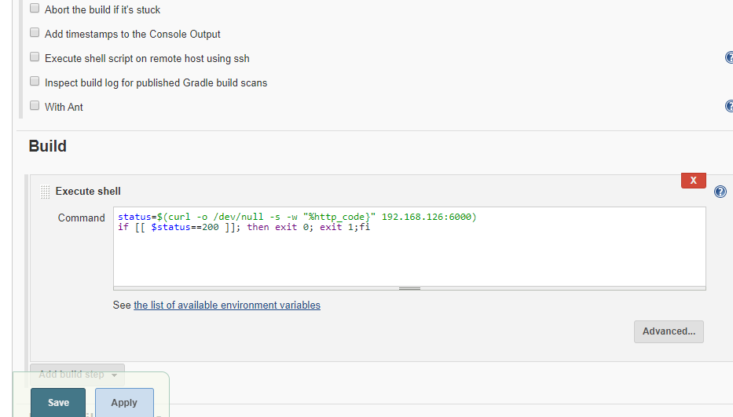

for using the e-mail following thing is to be done

first go to manage Jenkins then configure the system scroll down till the e-mail notification is found

and some changes are to be made in Jenkins file too

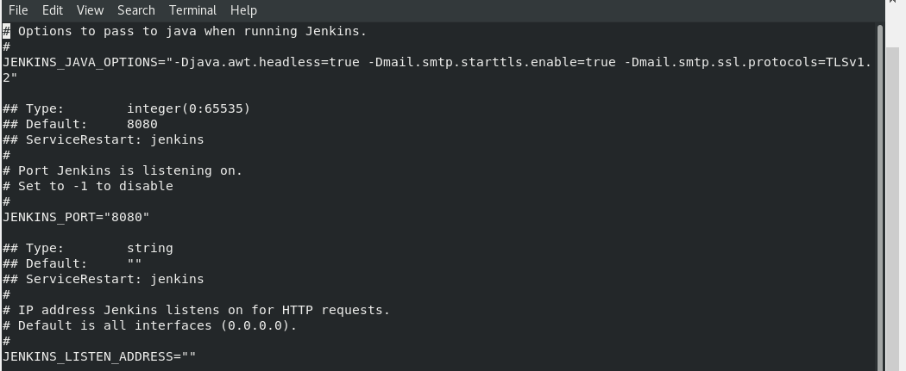

>In JENKINS_JAVA_OPTION=changes are made

and after this if there is an error, like in my case there was an error regarding authentication then you need turn on the access of the less secure website and turn off the 2 step login process.

>  job5 for monitoring: If the container where an app is running. fails due to any reason then this job should automatically start the container again.

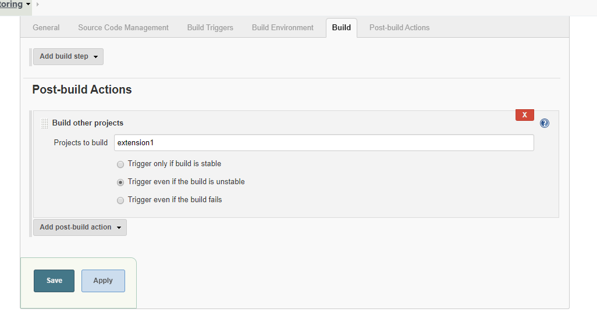

in post-build section trigger the job3 or extension1 job it will automatically start the container again

final build pipeline is:

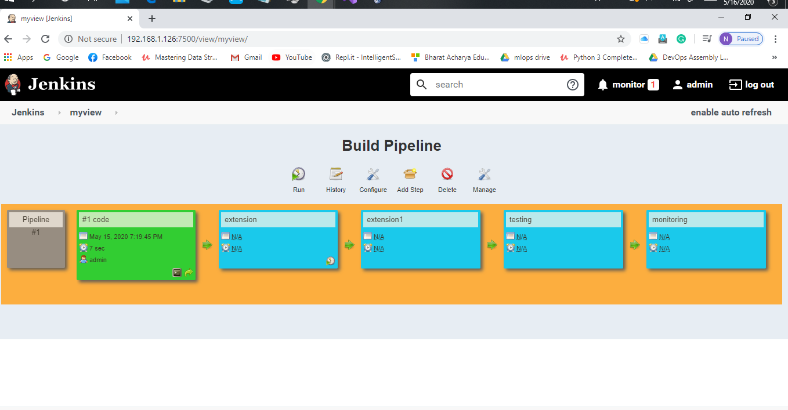

This is the end of the task allocated by Mr. Vimal Daga sir
I would like to thank Jenkins slack channel and WhatsApp mlops group mates I was stuck at many points where they helped me like in setting up ssh in Jenkins and how to send e-mail in Jenkins and the necessary changes to be made.

Thank you
